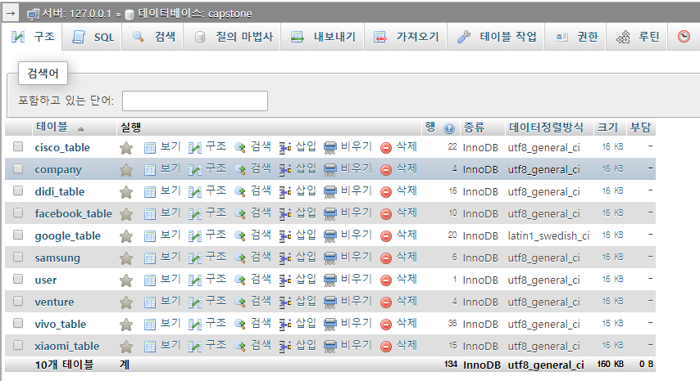
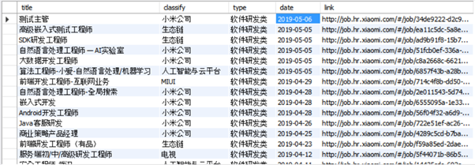
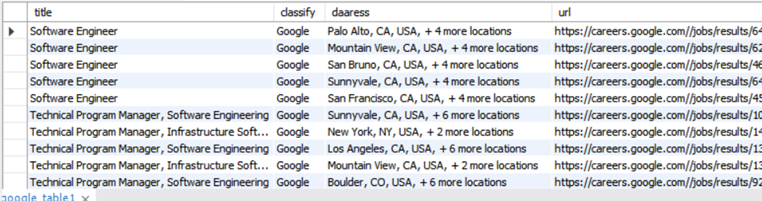
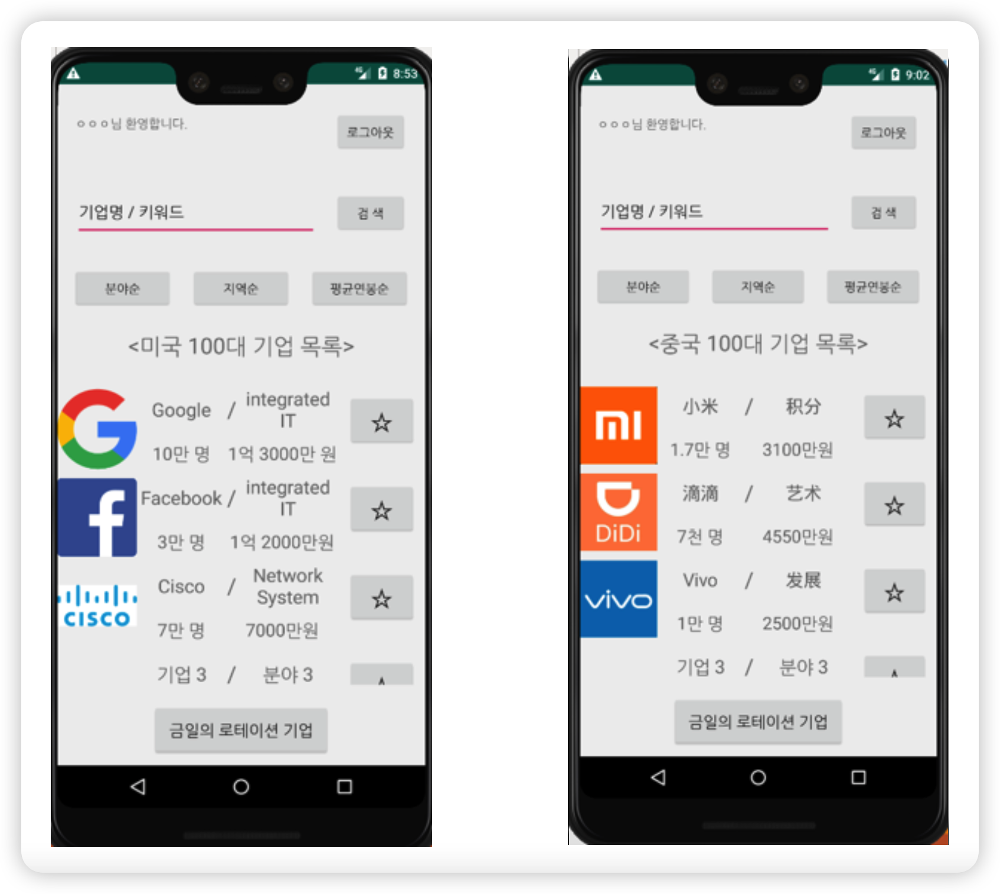
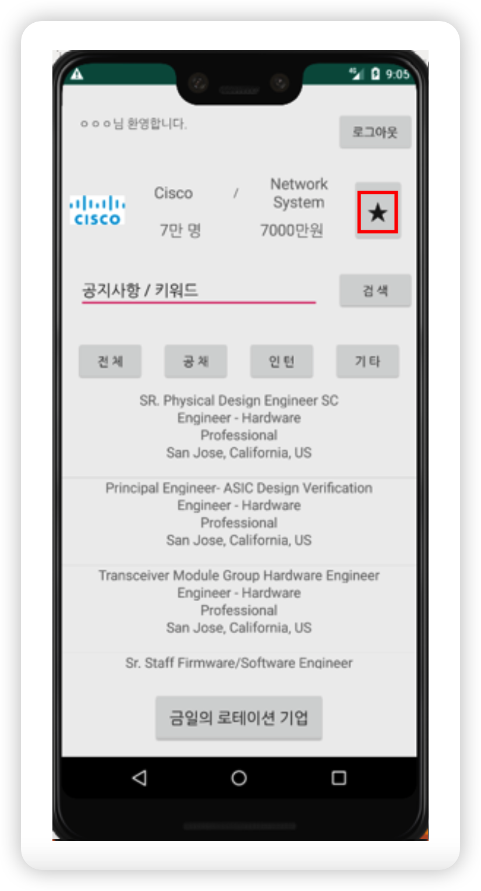
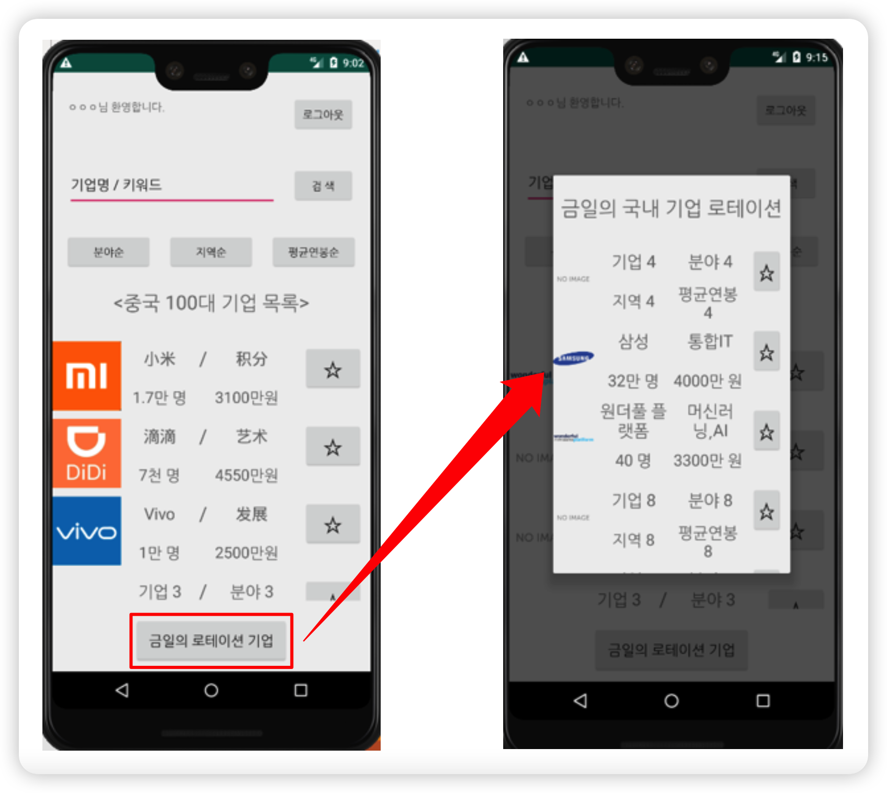
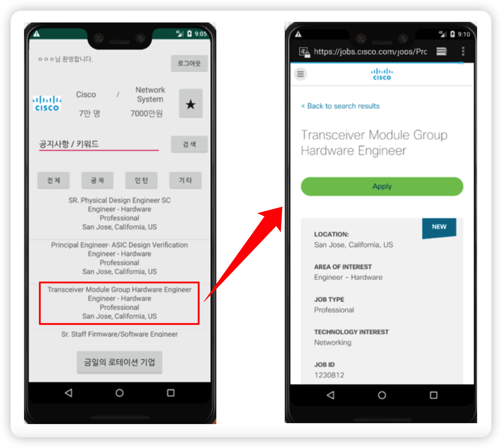

# Application-Using-Web-Crawling

> - *Employment Information Notification Application Using Web Crawling*
> - *웹크롤링을 이용한 취업정보 스마트 알리미 Application(잡하운드)*

관련 보고서는 [여기서](./Report) 확인할 수 있습니다.

## 배경
취업시장에서는 정보가 곧 경쟁력이다. 그로 인해 수많은 취업정보사이트들이 현재 개설되어 있으며, 다양한 기업들의 채용 정보, 합격 수기 등이 게시되어 있다. 그러나 이러한 사이트들을 이용함에 있어서 대부분의 사람들이 불편함을 느낀다. 
본 프로젝트는 아래와 같이 현 취업정보사이트들의 문제점을 해결하기 위해 개발되었다.
1. 가짜 구인정보 및 광고글
2. 복잡하고 원하는 정보를 찾는 데 시간 많이 소모
3. 해외취업을 원하는 준비생 수에 비해 해외취업에 대한 정보 제공이 막연하고 부족
본 프로젝트에서 기존 취업정보사이트들의 막연하고 진실되지 않은 해외취업 정보 제공을 해결하고자 한다. 

## 개요
1. 국내 중견기업과 대기업 취업정보 크롤링, 해외(미국, 중국, 일본) 유망기업 취업정보 크롤링
2. 사용자는 자신이 원하는 분야, 회사명 등을 키워드로 기업 검색하여 기업리스트로 표시 가능
3. 사용자는 관심있는 기업에 ☆을 터치하면 즐겨찾기 목록에 추가되고, 공지사항 업데이트 시 알림을 받을 수 있음
4. 기업을 터치하면 공지사항 리스트를 볼 수 있고 이는 대표단어(날짜, 채용공고, 인턴, 봉사)로 분류, 정렬할 수 있음
5. 매일 국내, 해외별 로테이션을 통해 다양한 기업 채용공고 제공
기업과 공지사항은 썸네일 형식으로 메인정보를 표시
   
## 기대효과
국내외 기업의 필요한 정보들만 추출해서 정확하고 신속하게 알림으로써, 사용자로 하여금 취업 시장 정보 탐색의 불편함을 줄여주고, 취업 성공의 목표를 달성하게 하는 것이다.

1. 사용자는 국내외 유망 회사의 성격을 명확하게 파악할 수 있으므로 사용자의 취향에 맞는 기업을 선택하는 것이 간단해지고, 목표의식을 뚜렷하게 부여해준다.
2. 키워드 검색 및 알림 기능을 사용하여 다른 경쟁자들 보다 더 빠른 정보를 얻고, 취업 준비에 있어 시간적 우위를 가질 수 있다.
3. 사용자들이 취업을 원하는 기업에서 진행하는 각종 프로그램들의 정보를 얻음으로써 취업 성공에 대한 자심감을 높일 수 있다.
4. 랭킹을 확인해서 사용자가 자신의 환경에 맞춰 유연하게 취업 지원을 함으로써, 취업 성공 확률을 높일 수 있다.
5. 허위 및 가짜 정보, 광고 등이 없으므로 사용자들로 하여금 정보 탐색의 불편함을 없애주고, 시간낭비를 없애 준다.

## Database

<strong>Database Table</strong>

 

<strong>Table에 저장된 내용</strong>

 

 

## 실행화면

<strong>나라별 메인화면</strong>

 

<strong>즐겨찾기</strong>

 

<strong>금일의 로테이션 기업</strong>

 

<strong>채용공고 선택</strong>

 

## Contact
Should you have any question, please contact gooni0906@gmail.com.

